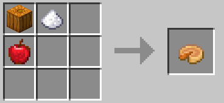
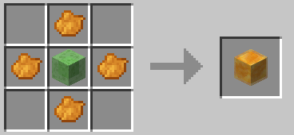

# Vegancraft 💚

Vegancraft is a Minecraft Java Edition Data Pack that slightly modifies some things to be able to play Minecraft without the need of hurting animals and their life.

For more info join the [Vegan Dreamland Discord Server](https://discord.gg/veg)!

## Development

If you have any additional ideas or feature requests, feel free to [open an issue](https://github.com/kesuaheli/vegancraft/issues/new).

## Contents

Here's a brief overview of what currently is changed

- [Mob Drops](#mob-drops)
- [Advancements](#advancements)
- [Crafting Recipes](#crafting-recipes)

### Mob Drops

**Spiders** and **Cave Spiders** always drop 1-3 Strings, and additionally 0-2 per Looting level. The drop chance of Spider eyes is unchanged.

### Advancements

The **A Balanced Diet** Advancement is changed so that only vegan itemes are requiered. Heres a full list of items that are currenlty requiered: *Apple*, *Mushroom Stew*, *Bread*, *Golden Apple*, *Enchanted Golden Apple*, *Cookie*, *Melon Slice*, *Rotten Flesh*, *Spider Eye*, *Carrot*, *Potato*, *Baked Potato*, *Poisonous Potato*, *Golden Carrot*, *Pumpkin Pie*, *Chorus Fruit*, *Beetroot*, *Beetroot Soup*, *Dried Kelp*, *Suspicious Stew*, *Sweet Berries* and *Glow Berries*

### Crafting Recipes

Some crafting recipes were changed or added.

The **Cake** is now crafted without milk and eggs. Instead you'll now need a sweet berry (for the topping) and an apple:

Also the **Pumpkin Pie** were changed to no longer require any eggs. Just replace it with an apple in its shapeless crafting recipe:

The **Honey Block** got an *additional recipe*! You are now able to craft a slime block by surrounding a slime block with 4 orange dye like this:

